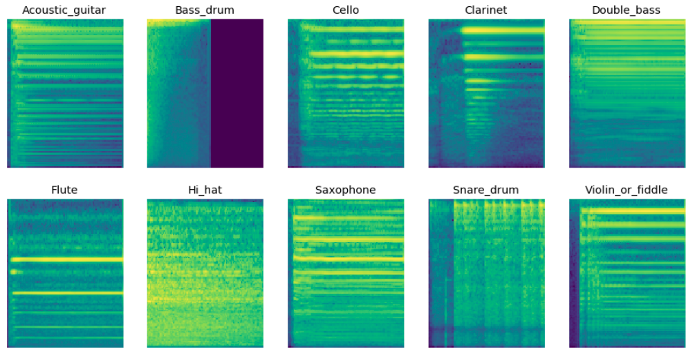
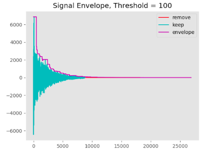
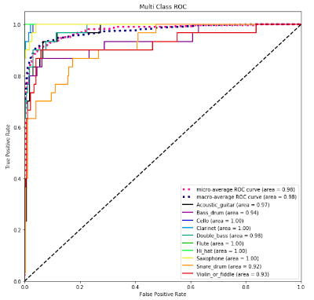

# Audio-Classification (Kapre Version)

<!-- TOC -->

- [YouTube](#youtube)
- [Audio Preprocessing](#audio-preprocessing)
- [Training](#training)
- [Receiver Operating Characteristic](#receiver-operating-characteristic)
- [Kapre](#kapre)

<!-- /TOC -->

### YouTube

Thanks for Teaching and Training  

https://www.youtube.com/user/seth8141

### Audio Preprocessing

clean.py can be used to preview the signal envelope at a threshold to remove low magnitude data

When you uncomment split_wavs, a clean directory will be created with downsampled mono audio split by delta time

`python clean.py`

### Training

Change model_type to: conv1d, conv2d, lstm

Sample rate and delta time should be the same from clean.py

`python train.py`

### Receiver Operating Characteristic

### Kapre

https://github.com/keunwoochoi/kapre  
https://arxiv.org/pdf/1706.05781.pdf